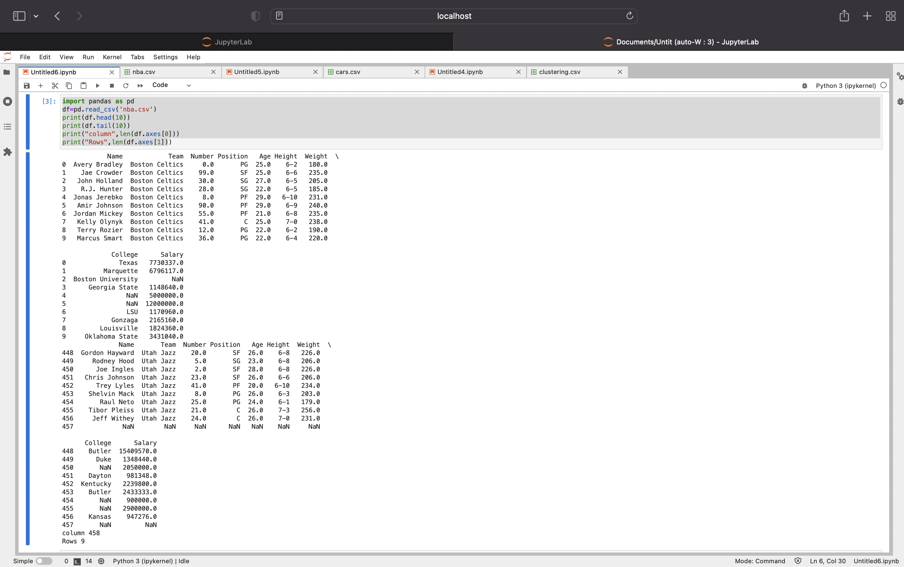

# Read-from-CSV

## AIM:
To find out of the length of rows and columns using pandas
## ALGORITHM:
### Step 1:
Import panda as pd
### Step 2:
For reading data we put code
### Step 3:
We give print(head(10)) to get output of first 10 lines
### Step 4:
We give print(tail()) to get a output of last 5 lines
### Step 5:
Next we have to put code for get length of row and column

## PROGRAM:
```
# Name:kamannakatta DeviJhansi
# Reference number:21005096
import pandas as pd
df=pd.read_csv('nba.csv')
print(df.head(10))
print(df.tail(10))
print("column",len(df.axes[0]))
print("Rows",len(df.axes[1]))
```
## OUTPUT:


## RESULT:
sucssefully length of rows and columns known using pandas
